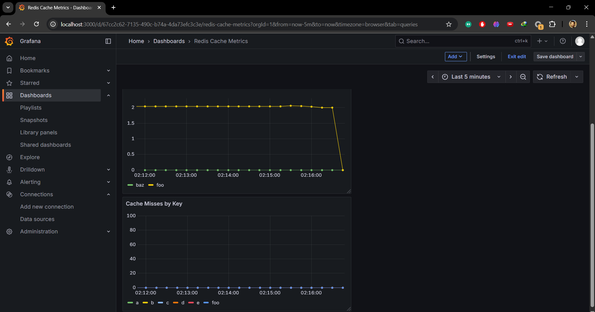

## 📄 README.md

# Docker & Observation Homework

This projecapp/configst is part of the Docker and Observability homework.  
The goal was to take the sample **Flask + Redis** application, add a new Prometheus metric for cache misses, and visualize everything with **Prometheus** and **Grafana**.

---

## 📂 Project Structure

```

docker-and-observation-hw/
├── app/                 # Flask application and Docker setup
│   ├── app.py
│   ├── Dockerfile
│   ├── docker-compose.yml
│   └── configs/
│       ├── prometheus.yml
│       ├── alerting\_rules.yml
│       └── grafana-dashboard.json
├── assets/              # Outputs of the assignment
│   └── dashboard.png    # Screenshot of the Grafana dashboard
├── .gitignore
└── README.md

````

---

## ⚙️ How to Run

### 1. Start the stack
From inside the `app/` directory:

```bash
docker compose up -d --build
````

### 2. Available services

* **Flask App** → [http://localhost:9000](http://localhost:9000)
* **Prometheus** → [http://localhost:9090](http://localhost:9090)
* **Grafana** → [http://localhost:3000](http://localhost:3000) (user: `admin`, password: `admin`)

---

## 📊 Implemented Metrics

Two main custom metrics were added to `app.py`:

* `redis_app_cache_hit_total{key="..."}` → Counts cache hits per key.
* `redis_app_cache_miss_total{key="..."}` → Counts cache misses per key.

### Example usage:

```bash
# Cache miss
curl -i http://localhost:9000/items/foo

# Insert a key
curl -i -X POST http://localhost:9000/items \
  -H 'Content-Type: application/json' \
  -d '{"key":"foo","value":"bar"}'

# Cache hit
curl -i http://localhost:9000/items/foo
```

Prometheus will scrape these metrics from `/metrics`.

---

## 📈 Grafana Dashboard

A Grafana dashboard was created with three main panels:

1. **Cache Misses by Key**
2. **Cache Hits by Key**
3. **Cache Miss Ratio**



---

## ✅ Summary

* Added a new metric: `redis_app_cache_miss_total`.
* Built a Docker Compose stack with **Redis + Flask + Prometheus + Grafana**.
* Created a Grafana dashboard to visualize cache behavior.

This completes the homework requirements.
